# DATASET CREATION - MONOCULAR DEPTH ESTIMATION AND SEGMENTATION SIMULTANEOUSLY

**Building a custom dataset for monocular depth estimation and segmentation simultaneously**

* Select any "scene" image. we call this as background 
* Make 100 images of objects with transparent background. we call this as foreground
* Create 100 masks for above foreground images. tool like GIMP or power point can be used
* Overlay the foreground on top or background randomly. Flip foreground as well. We call this fg_bg
* Create equivalent masks for fg_bg images
* Use this or similar [Depth Models](https://github.com/ialhashim/DenseDepth/blob/master/DenseDepth.ipynb) to create depth maps for the fg_bg images:

## What dataset is created?

* For background, selected theme is "Classroom"
* For foreground objects, student or/and teacher is selected. 

## Work Items

* create_dataset.ipynb[(Link)](create_dataset.ipynb): Notebook for dataset creation.
* DenseDepth.ipynb[(Link)](DenseDepth.ipynb): Notebook for dense depth creation for fg_bg images
* dataset_statistic.ipynb[(Link)](dataset_statistic.ipynb): Notebook for describing created dataset. count, datasize, means, visualization etc

## Custom Dataset
Google drive link for all the dataset are as below:

* bg images[(Link)](https://drive.google.com/open?id=1wjRX9h8PhaS2iJN4A0utlNhZkvsiUAMW): Square shape (192X192) background images
* fg images[(Link)](https://drive.google.com/open?id=1e3Pp7zMZOiXGqrRbblRVxO3q_0Ch0m3-): Foreground images
* fg_mask images[(Link)](https://drive.google.com/open?id=1Phw6KL1z2dbRpvOB369LyZLnWMo2nY-d): Mask for fg images
* fg_bg images[(Link)](https://drive.google.com/open?id=14txr_9iw6Vjfc7p4d-daAtq21-makeH_): each fg images are overlays randomly 20 time on the background. same thing is repeated for Flip images. Hence 40 images are created for each fg ovelay on each bg.
* fg_bg_mask images[(Link)](https://drive.google.com/open?id=12fRHHV-_x1GCmE6tTbgHiAX-tlPYiHyO): Equivalent mask for fg_bg images
* fg_bg_depth images[(Link)](https://drive.google.com/open?id=1-1aTnL5x5vwQgk-24mENomq9MQuxCPjW): Depth images for fg_bg
 
## Results 

Let's have quick summary of dataset and visulaization for each kind of images

**Dataset statistics**

Notebook: **dataset_statistic.ipynb**[(Link)](dataset_statistic_updated.ipynb):

<p align="center">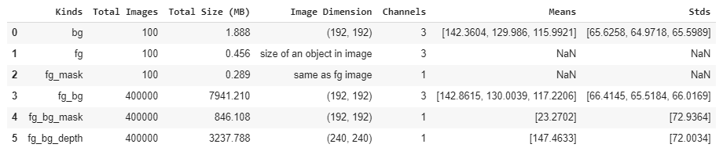</p>

**Dataset visualization**

Below plot show the randomly selected images from the custom dataset.
* bg images
* fg images
* fg_mask images
* fg_bg images
* fg_bg_mask images
* fg_bg_depth images

<p align="center">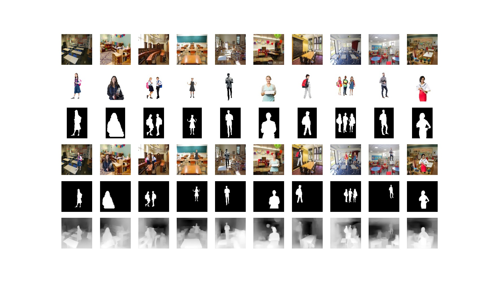</p>

**Dataset creation time**

* fg_bg and it mask images : it tooks 2:40 hours
* Depth images : it tooks 4:53:21 hours

## Dataset creation procedure

Notebook: **create_dataset.ipynb**[(Link)](create_dataset.ipynb)

## Some dicipline in folders and file naming convention

* Dicipline is required to manage the entire dataset. seperate folder is maintained for each kind of dataset: bg_images, fg_images, fg_mask_images, fg_bg_images, fg_bg_mask_images, fg_bg_depth_images.
* File naming guideline
  * For bg_images, fg_images, fg_mask_images dataset filename format: img_xxx.jpg (where xxx -> 1 to 100)
  * For fg_bg_images, fg_bg_mask_images, fg_bg_depth_images: fgxxx_bgxxx_xx.jpg or fgxxxflip_bgxxx_xx.jpg(Example: fg099_bg080_10.jpg or fg099flip_bg080_10.jpg

## Dataset challenges for handling 400k images?

* Creating 400k fg_bg images on colab takes long time to sync and hence Zipfile package is used and all new files are directly appended to the zip resource.
As zip file is single resource, colab is fast to sync this resource. As soon as zip file is created in colab, it is immediately accessible to all colab notebook for immediate use.
User no need to wait for zip file to sync to their local machine.
* Processing all 400k images need lots of RAM and it result in memory overrun. so approach is to process the images in batches and free the memory after each iterations so that memory requirement does not grow
* For Depth prediction, images are processed in batch 1000 images and freeing memory once processed.
* For mean calculation of entire dataset, first mean are calculated for each batch of images and  then these batch mean are used to find the mean for entire dataset.

## Creation of background images - square shape

* zip plugin for google chrome is useful to download all the images in one shot from internet
* As images are of different shapes and resolution. so utility function is created to filter very high or low resolution images and resizing the images to 192X192 dimension.
* Why 192?
  * size shall be multiple of 32 in order to work with nyu depth prediction model.
  * too high resolution images required more computation and RAM, so 192 is choosen so as to not suffer suffer with prediction efficieny and also RAM/computational requirement remains under control.
  * there is always a trade off between higher efficieny or resource requirement.
* bg file names are maintained as img_xxx.jpg (examples: img_001.jpg to img_100.jpg)
 
## How foreground images and its equivalent mask are created?

* Transparent forground is created using power point tool and saved as png file. 
* It has four channel where fourth channel is an alpha channels containing transparent background and alpha channel is used for fg_mask creation.
* As we need to have just forground object so resize image to the size of the object in image. Utility fucntion is created to cut the portion of image using cv2 package by making use of finding the object structure and its contours.
* Create equivalent mask using alpha channel.
* Mask are created as single channel as we need to just represent white or black pixels and is sufficient to represent the mask. 
* fg file names are maintained as img_xxx.jpg (examples: img_001.jpg to img_100.jpg)
* For each fg images, same file name is maintained for its fg_mask . [format: img_xxx.jpg]

## How fg_bg images and its equivalent mask are created?

* Inputs are: bg_img, fg_img, fg_mask images
* Output are: fg_bg and equivalent fg_bg_mask image. mask contains same file name for its fg_bg images
* Mask are created as single channel as we need to just represent white or black pixels and is sufficient to represent the mask.
* refer notebook create_dataset.ipynb[(Link)](create_dataset.ipynb) for implemtation details 
* it took around **2:40 hours** to create fg_bg and its mask images.

Let's look into example below explaining how fg_bg image is created.

```
bg_img -> input background image (192, 192, 3)
```

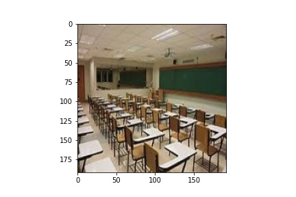

```
fg_img -> input foreground image (102, 68, 3)
* Note: dimension vary for each fg images based on the object size in the image
```

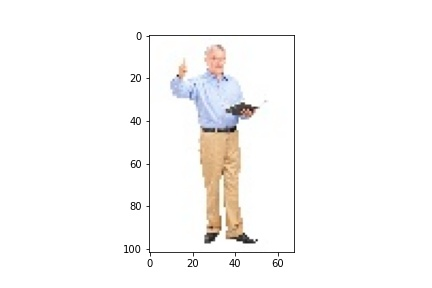

```
fg_mask -> input foreground mask image (102, 68, 3)
```

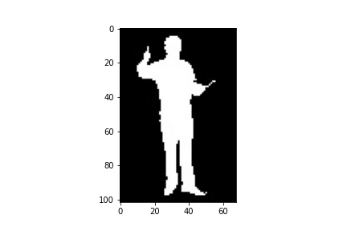

```
# Create forground image with black background. (102, 68, 3)
fg_img_with_mask = cv2.bitwise_and(fg_img, fg_mask)
```

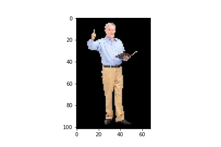

```
# Choose random locations for masking. start location is choosen such that fg image get fits within bg image.
h_start = np.random.randint(0,bg_img.shape[0]-h)
w_start= np.random.randint(0,bg_img.shape[1]-w)
```

```
# Create mask for fg and bg overlay images (192, 192, 3)
fg_bg_mask = np.zeros(bg_img.shape, bg_img.dtype)
fg_bg_mask.fill(0)
fg_bg_mask[h_start:h_start+h, w_start:w_start+w] = fg_mask[:,:]
```

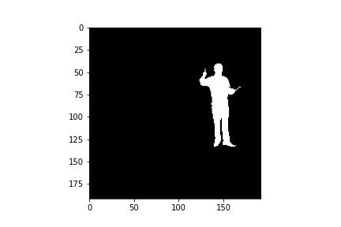

```
# Creat inverted mask. (192, 192, 3)
fg_bg_mask_inv = cv2.bitwise_not(fg_bg_mask)
```

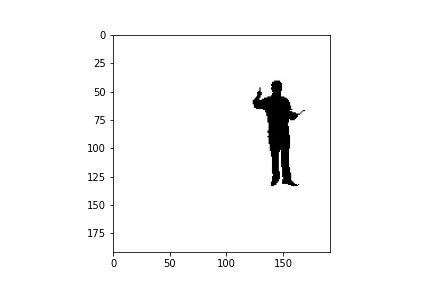

```
# background image with foreground portion filled with black (192, 192, 3)
bg_overlay = cv2.bitwise_and(bg_img, fg_bg_mask_inv)
```

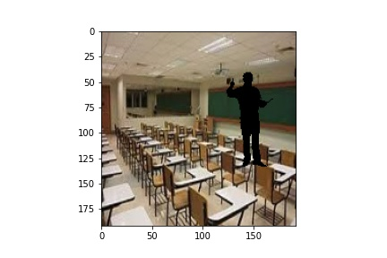

```
# image with only forground portion is filled and remining background is kept black (192, 192, 3)
fg_overlay = np.zeros(bg_img.shape, bg_img.dtype)
fg_overlay.fill(0)
fg_overlay[h_start:h_start+h, w_start:w_start+w] = fg_img_with_mask[:,:]
```

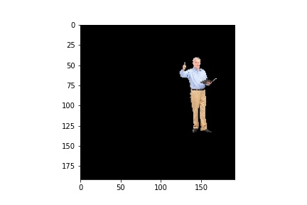

```
# Finally add both fg overlay and bg overlay images to get the fg_bg image (192, 192, 3)
fg_bg = cv2.add(bg_overlay, fg_overlay) 
```

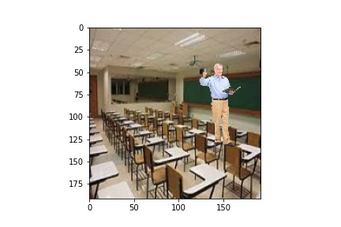

## How depth images are created for fg_bg images?

Notebook: **DenseDepth.ipynb**[(Link)](DenseDepth.ipynb)

**Few challenges in handling 400k images?**

1. loading all 400k images at a time is not feasible due to memory limitation
2. Processing of 400k images takes 4.5~5 hours and it is possible that notebook execution can terminated in between.
   we need to ensure that in next iteration it shall start from the place it got stopped.

**To solve above issues**
1. depth images are created in batches. for each foreground there are 4000 images. batch is processed at foreground level.
after every batch, memory are freed to ensure that it is avaiable for next iteration.
2. user shall provide the proper range for images for processing. 
3. Zip file resources are created in append mode and all new depth file is added to the resource.
   all previous processed depth images are retained in out zip file and avaialble for recovery.

**Step followed:**

* nyu model is used [(Depth Models)](https://github.com/ialhashim/DenseDepth/blob/master/DenseDepth.ipynb) to create depth maps for the fg_bg images:
* ZipFile package is used to read from zip(400k fg_bg inputs) and write into zip file(400k depth outputs) so as to avoiding data sync issue in colab.
* Data work flow is updated to process only 1000 images at a time for prediction to avoid memory overrun issues.
* nyu Depth model does't give good result for low resolution images so input fg_bg images **(192,192,3)** are upsampled to **(480,480,3)**.
* each fg_bg images are fed into model for prediction and model produce one channel output with half of input dimention. Hence output dimension is **(240, 240, 1)**
* output is rescaled between min and max to highlight the objects in the images
* final depth images are created as single channel as gray scale.
* depth output file name is retains same as the input filename. 
* it took around **4:53:21 hours** to create depth images.

 
below is the results of depth mask prediction.

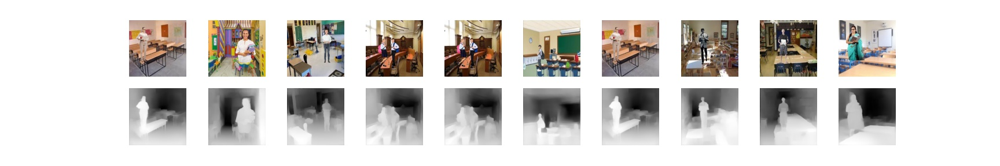   

