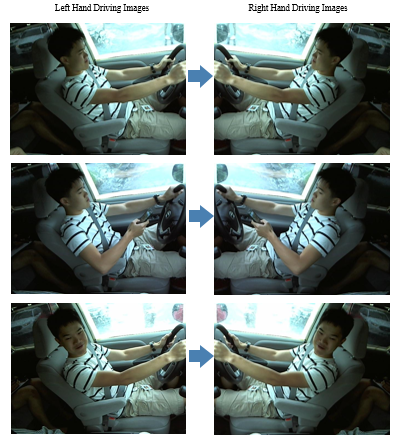
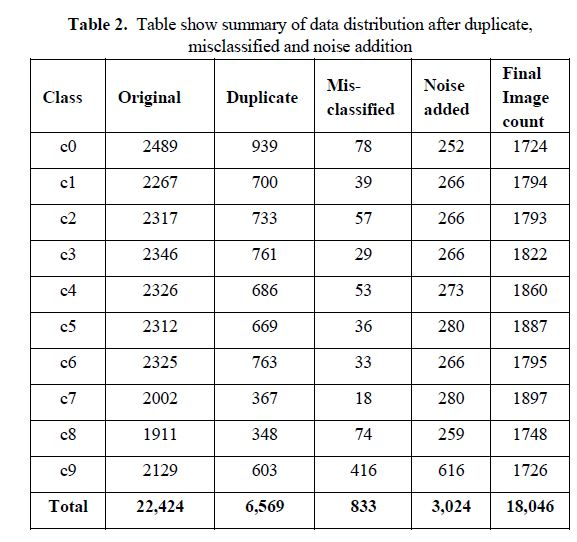

# DRIVER ACTIVITY MONITORING

**AI based Driver Activity Monitoring Solution to avoid car accidents due to driver distractions**

## Project Description

The objective is to build a model that monitors driver activities under varieties of driving conditions and external environment including driving during day time and night time. A predictive system that can recognize any distraction while driving like expression arising due to attending phone calls, testing, drinking, talking to the passenger, or deviating from the standard driving alignment, and this is going to be a multi-class predictive system. This system is useful in the prediction of such anomalies and retrospection of an unlikely and any unfortunate event of accidents

This work is implementing the ResNet50, VGG16, and custom CNN classification network on State Farm Distracted Detection Kaggle case study competition dataset. This is left-hand driving dataset contains 22,424 images belonging to 24 different drivers and categorized into 10 classes. We faced many challenges with the dataset such as duplications of images, misclassified images, it does not contain samples for night-time driving, and each of the class images is captured from different camera angles. We prepared the dataset by identifying duplication using the Structural Similarity Index Measure (SSIM) algorithm, manually removing misclassified images, adding noise through Python Imaging Library (PIL) to accommodate various lighting conditions and camera angle positions.

Three different network are designed by trying with various network-layer changes and tuning hyper-parameters. Performance comparison analysis is carried out among all there models based on their classification accuracy, F1 score for each class, average weighted F1 score, volume in term of the number of parameters involved in the computation for predicting class and finally, we find out the optimal model best suited for cloud-based deployment and edge devices.
The applicability of the proposed solution is further tested by deploying a model on Raspberry PI4(RPI4) hardware. In our experiment, RPI4 is chosen because of its support for python packages, tensorflow, and Keras packages. This device is installed inside the vehicle in front of a driver to capture the live streaming images and the captured image is then fed to the model for prediction. We achieved satisfactory results in predicting the driver activity on-field by running the camera at 5FPS and 30FPS (Frame per second), hence show the true picture of the accuracy and robustness of the model

## Model Building Workflow

The below figure illustrates the workflow for model building and shows how data preparation is carried out for handling duplication and misclassification. All images went through a horizontal flip to get a right-hand driving dataset. Noise is added to the data to accommodate various lighting conditions and adding effects of the external environment, and this dataset is then used for building a right-hand driving model. Dataset is preprocessed and then is divided into training and validation parts with a split ratio of 70:30, which means 70% of the dataset is reserved for training and 30% for validation. Model is finally deployed on Raspberry PI(RPI4) for real-time testing.

The model is developed for Right Hand Driving as we targeted solutions for the India market. However, the same model can be used to predict the driver’s activity for left-hand driving. It can be achieved by performing a horizontal flip of the input images which create the mirror image and then it is fed to the model for prediction. The below diagram shows how the proposed model can be reused for left-hand driving.

## Dataset(s) Description

The Dataset used in this project is from State Farm Distracted Driver Detection Kaggle case study competition. The dataset contains 22,424 images categorized into 10 classes. Each image in the dataset is 640 X 480 pixels. This dataset contains images of 26 unique drivers and each class has data for each driver. It also contains a test dataset of 79,726 images which are not labeled. This test data contains images for the driver which does not exist in the training dataset. Test data is not used and seen while building the model. We have used test data only for verification to check the applicability and robustness of the model.
In training dataset, images are categorized into 10 classes as below:

- c0: safe driving
- c1: texting - right
- c2: talking on the phone - right
- c3: texting - left
- c4: talking on the phone - left
- c5: operating the radio
- c6: drinking
- c7: reaching behind
- c8: hair and makeup
- c9: talking to passenger

## Dataset Challenges

The existing dataset is for daytime driving and it does not contain data for night-time driving. Similarly, night-time driving data for each of the 10 classes are also needed. It is also observed that the dataset does not contain classes that lead to many common accidents and are very sensitive to save driving. An example such as a drowsing class is missing. On further exploration of data, we found that there exist duplicate images in each class. Also, there are many images which are wrongly classified.

## Data Preperation  [(Link)](eda) 

The availability of good quality dataset is an important factor in developing the right model. As existing dataset has many challenges of duplication, misclassification, lack of variability of driving conditions and hence we mitigated all these challenges in data preparation stages.

**Duplicate Removal**

As we have seen there are duplicate images for the drivers in each class and when the models were trained on this dataset as it is an unexpected accuracy of ~99% is observed for even basic model architecture, thereby making the models working well on validation set but not on real-time camera feed (production data).
The similarity between the images was measured to identify the duplicate images. We have leverage compare library from skimage for calculating Structural Similarity Index Measure (SSIM). SSIM value helps to identify whether two images are similar or not. This value can fall into the range [-1, 1] with a value of 1 being close to a perfect match. A similarity threshold of 0.8 was set to identify similar images.
The below figure shows the two different sample images of the same driver taken from a safe driving class. It demonstrates the similarity measure calculated using compare_ssim library of skimage package. For below two images, calculated SSIM value is 0.95 which indicates that these images are very similar to each another and hence image2 is ignored from the dataset.

Image per driver per class was compared with the rest within the class and wherever the SSIM value was greater than 0.8 the images were discarded else kept in training set. The below figure shows class wise duplicate data found on the dataset. Total of 6,569 duplicate images are identified.

**Treating Misclassified Data**

The training dataset had incorrect labeling of the images and these misclassified images in each class were identified manually. The below figure shows the samples of misclassified images for few classes.

A total of 883 misclassified samples are identified and the below figure shows the distribution of misclassified images per class.

**Creating Right Hand Driving Dataset**

Right hand driving dataset is created by creating the mirror image of the existing Left-hand driving dataset. We leverage the horizontal flip feature of the Python Imaging Library (PIL) that helps us to create a mirror image for each sample. The below figure shows the samples of mirror images for classes

**Adding Noise to the Dataset**

To make the model more generic and avoiding prone to overfitting, it is necessary to include some more variation to the dataset to increase the robustness of the model. The given training set was not modular to cater all kinds of a real-time condition like change in brightness, change in driver position, etc., and to fulfill all the certain conditions some noises are incorporated to the existing training dataset.

## Final Data Preparation Summary

The below table shows how data distribution per class has changed after each data preparation step, i.e. post removal of duplicate data, handing of misclassified images and finally adding noise to add variability to the dataset.

Below is the final distribution of the data across all classes after removal of duplicates, misclassified treatment and adding noise

**Finally, dataset of size 18,046 is used for building model.**

## Experiments and Implementations

Model(s) were trained using various input sizes. Initially, the models were trained with the standard size of 224*224 as this is the standard norm for these models (VGG16 and RESNET50) this image size resulted in a high number of model parameters and the model became computationally intensive for prediction. Models were trained with various image sizes and F1 scores were compared. It was observed that the image size 128*128 gave a better F1 score compared to other low size images and 128*128 image size was fixed for all the models

**Model using ResNet50** [(Link)](build_model/resnet50) 

The model is build using ResNet50 architecture where the last layer is replaced with softmax layer of 10 classes. The two dense layers of size 1024 and 512 are added on top of the ResNet50 model. The model is build using Stochastic Gradient Descent (SGD) optimizer with a learning rate of 1e-3, decay of 1e-6, momentum of 0.9, batch size of 64 and epochs size of 50. Initial weights for training were taken from the pre-trained ResNet50 model. As per preprocessing step all images are resized to 128 X 128 and normalized. The total number of parameters of the model found to be 57,673,098 out of which 57,619,978 as trainable parameters. Below figure show model architecture using ResNet40.

**Model using VGG16** [(Link)](build_model/vgg16) 

The Below figure show model architecture using VGG16 architecture.

The proposed model is build using the VGG16 network where the last layer is replaced with a softmax layer of 10 classes. The three dense layers have also been added with outputs of 1024, 1024 and 512 after the existing convolutions block. ReLU activation function is used in the dense layer. As per preprocessing step all images are resized to 128 X 128 and normalized. The bottom four convolution block of the VGG16 model are freeze and made non-trainable and initial weights for the model were taken from the pre-trained VGG16 model. After experimenting with various hyperparameters, the final model is build using RMSprop optimizer with a learning rate of 1e-4, batch size of 16, epochs of 200 and categorical cross-entropy is used as the loss function with metrics as accuracy. The total number of parameters of the model found to be 23,634,250 out of which 15,998,986 as trainable parameters.

**Custom CNN Model** [(Link)](build_model/custom_cnn) 

The custom CNN based is build using Convolution Network, max-pooling, and fully connected layer. Objective behind having custom CNN model to find model with volume less than 1million parameter and F1 score above 0.95. This model is build using 5 convolutions layer with each layer is followed by max-pooling of size 2X2 and dropout layer with rate of 0.25. In each convolution layer padding is set as “same”. For first two layers kernel size is 3X3 and for layer 3,4 and 5, the kernel size is used as 5X5. As per preprocessing step all images are resized to 128 X 128 and normalized. After experimenting with various hyperparameters, the final model is build using RMSprop optimizer with a learning rate of 1e-3, batch size of 64, epochs of 50 and categorical cross-entropy is used as the loss function with metrics as accuracy. The total number of parameters of the model found to be 649,162 which is very less as compared to volume reported by ResNet50 and VGG16 model. Below figure show model architecture for custom model using CNN and dense network.

## Model Performance Comparison

We performed a performance comparison analysis of the above three models (ResNet50, VGG, and custom-CNN) by comparing their validation accuracy, logarithmic loss, epoch convergence, model size and F1 score of each class and average weighted F1 score.

Below are few recommendations after model comparison.
- The ResNet50 model has shown better results compared to the other two models (VGG16, Custom CNN) because of higher validation accuracy of 98.89, lower log loss of 0.0516, and better average weighted F1 score of 98. However, this model uses around 57M parameters for prediction and hence it is recommended to be deployed on the machine which has high computational power and memory such as cloud-based infrastructure or high-end machine.
- The custom CNN based model gave an validation accuracy close to 97% and with a weighted average F1 score of 97% and has less than 1M parameters for computation, so it is recommended to use the custom CNN model for edge devices.

## Deploying Model on RPI-4

**Python:** [(Link)](rpi_code/AI_DAM_sol_picamera.py) 

## Test Results

**Performance Result on Test Data**

We build the solution using the ResNet50 model and performed testing on test data (unseen data). As test data available with us is for left-hand driving, so we build a solution as per procedure is shown in Figure-2 where inputs test images are horizontally flipped before it is passed to the model for prediction. The solution first read the input test image file, it is horizontally flipped, resized to 128 x 128 X 3 and normalization and finally, the pre-processed input data is passed to the model for predicting top 3 class probability. These test images are selected at random from the test dataset of 79,726 images which are not labeled. These test images are unseen and never used for building the model. All the available test images are for the different drivers that does not exist in the training dataset. A few samples of test results are shown below:

**Performance Result of Custom CNN Model deployed on Raspberry PI4 hardware**

We also performed limited testing on the field with Raspberry PI4 (RPI4) hardware where the Custom CNN model is deployed for testing. The camera is configured for 5 FPS to capture the frame at 640 X 480 pixels and captured frame data is passed to the model for prediction.

The below samples are the actual field test results on Raspberry PI4 device facing real driver inside the vehicle.

**Suggestions - Further Work**

While working on this project we faced few challenges while performing field testing on realtime camera feed and below is the action plan that can be considered for future work:
- Model training needs to happen on a more diversified data set to include noises like open market background and dataset need more diversified driver poses or camera angles.
- Use of advanced techniques like GANs to generate synthetic data for various driver's poses.
- Model can be made more generalized by introducing more classes like drowsing, taking selfies, another person’s intervention to the driver while driving and many others.
- Explore other advanced Computer vision techniques like image segmentation, group convolution, pose detection algorithm, gesture recognition, object detection, etc.

