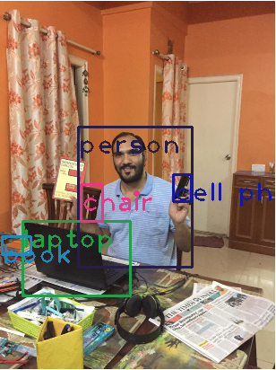

# Assignment 13-1: YOLO Object detection using OpenCV and Python

Refered Link: https://pysource.com/2019/06/27/yolo-object-detection-using-opencv-with-python/

Result: Annotated Image by YOLO
-------------------------------

----------------------------------------------------------------------------------------------------------------

