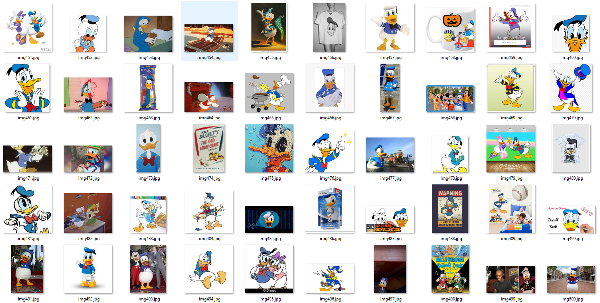

# Assignment 13-2: Training custom dataset for YOLOV3

New Class used: Donald Duck
--------------

Refered resources:
------------------

- colab: https://colab.research.google.com/drive/1LbKkQf4hbIuiUHunLlvY-cc0d_sNcAgS
- GitHub: https://github.com/theschoolofai/YoloV3
- https://www.y2mate.com/en19 (for downloading youtube video)
- https://github.com/miki998/YoloV3_Annotation_Tool [annotations tool]
- https://en.wikibooks.org/wiki/FFMPEG_An_Intermediate_Guide/image_sequence [FFMPEG tool]

Package Descriptions:
---------------------

Solution File: /YoloV3/YoloV3Sample_DonaldDuck.ipynb

1. /YoloV3/ : root directory which contains the entire package
2. /YoloV3/cfg: contains config file for model configuration
3. /YoloV3/data/customdata: 
- custom.data: contains path for train and validation data, class names, and number of classes
- custom.names: contains class name. for this assignment it contains only one classname: donald duck
- custom.shapes: contain shapes for all inputs images in same order as files in /images/ folder.
- custom.txt: path for all the images to be processed
- images: contains all the input images in incremental filename. user need to unzip images.zip
- labels: contains annotation for each files. user need to unzip lables.zip

Steps Followed:
---------------

1. 500 unique dataset collection for class not present in YoloV3
2. Annotations
3. Configuration for yolov3-custom.cfg
4. custom data preperation
5. training
6. video frame genertaion for youtube video using ffmpeg tool
7. applying detect.py on video frame for object detection. it generate frames with predicted bounding boxes
8. generate final yolo video for frame having predicted bounding boxes
9. upload video on youtube.

Configuration for yolov3-custom.cfg
-----------------------------------

path: /cfg/yolov3-custom.cfg

Following Two changes are done in .cfg file. classes=1 and model only one class dataset:

- Filter size for last convolution layer is set as 18 [(classes(1) + objectiveness(1) + bbox(4)) * num of anchor boxes(3)]
- classes=1 

Custom dataset Preperation and setup
------------------------------------

- 500 unique images are downloaded from internet
- Each images filename are set in orger for smooth operation as img001.jpg, img002.jpg to img500.jpg
- all images are placed under /data/customdata/images
- All images are annotated using YoloV3_Annotation_Tool. For each images correcponding annotation file is saved as .txt with same file name.
- All annotations files/labels are placed under /data/customdata/labels
- images file name and its lables file name shall be same. Example: img001.jpg<==>img001.txt

Sample dataset collected from internet
--------------------------------------

Model Weight Folder:
--------------------

- weight folder is created under Yolov3 root
- yolov3.weights and yolov3-spp-ultralytics.pt are place under this "weight" folder

Model Training:
---------------

invoke train.py with proper -data and --cfg argument as below:

# Bounding box and class prediction for video frame downloded from youtube
---------------------------------------------------------------------------

1. Short video having "donald duck" as object class is downloaded from youtube using y2mate tool

2. ffmpeg tool is used to get the frames from mp4 video. all video frame is stored under "video_frames" folder

- Following command is used to pick frames for specific time interval:

ffmpeg -i inp_video.mp4 -ss 00:02:20 -to 00:02:50 image-%04d.jpg

3. detect.py is applied on input video frame and output frames are created with predicted bounding boxes

4. ffmpeg tool is then used to generate the output video(.mp4) from output frames

ffmpeg -i image-%04d.jpg donald_duck_yolo.mp4

Result: 
-------

1. Yolov3 object detection video for detecing "Donald Duck" is uploaded on YouTube.

Link: https://youtu.be/zkVfTjr1ml4

2. Additionally, same excersice is repeated for another class "flying disc" and is also uploaded on YouTube.

Link: https://youtu.be/FmgJykA-e-8

----------------------------------------------------------------------------------------------------------------

