## IMAGE CLASSIFIER: Deploying pretrained MobileNet_V2 network on AWS Lambda using serverless computing.

## Overview

* Using serverless open source framework to build and run application on AWS. Serverless framwork manages all the resources in AWS and user need to just focus on their Application and problem solving.
* All the AWS resocures such as API end point, Lambda functions, Cloud Formations, application packages on S3 and many mores resources are created automatically. It's very cool as it takes all the burden of server resource management from the user.
* Application is deploy as AWS Lambda function which fetch model from S3 bucket.

### web applications is hosted on AWS S3 bucket

### Image Classification [(Visit)](https://s3.ap-south-1.amazonaws.com/www.aijourney.com/eva4p2/s1_demo.html)
   **Image Classification Web Link:** https://s3.ap-south-1.amazonaws.com/www.aijourney.com/eva4p2/s1_demo.html

## Here is the quick summary of step by step procedure to build and deploy AI applictaion over AWS

1. Pre-Requisite: 
    * Oracle VM virtual Box
    * OS: Ubuntu-20.04
    * Miniconda environment with necessary python package
    * npm and serverless open source package are installed.
1. Create a serverless function. It generate boilerplate for template: aws-pythom3
2. Install a serverless plugin which helps bundling dependencies from a requirement.txt file. 
3. Deployment script
6. Update handler function in handler.py
7. Update configurations in serverless.yml
8. Create mobilenet_v2 pretrained model and upload on S3 bucket
8. Deploy the package
9. API gateway configuration for Binary Media Type
11. Testing Deploying using API tool

## Let's walk through on each steps in details

### Create a serverless function

Making use of aws-python3 template to create service

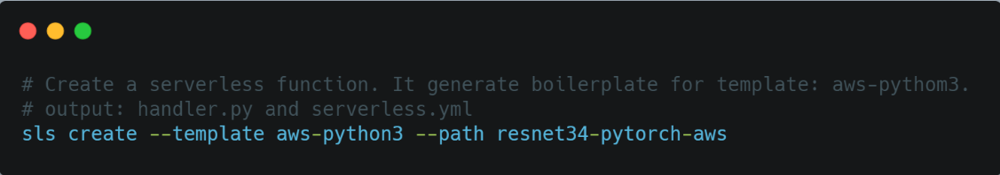

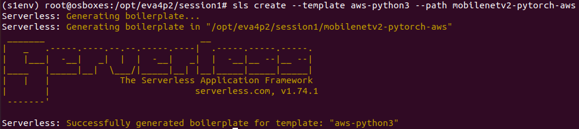

### Install serverless plugin
Install a serverless plugin which helps bundling dependencies from a requirements.txt file. The serverless-python-requirements plugin allows you to even bundle non-pure-Python modules. 

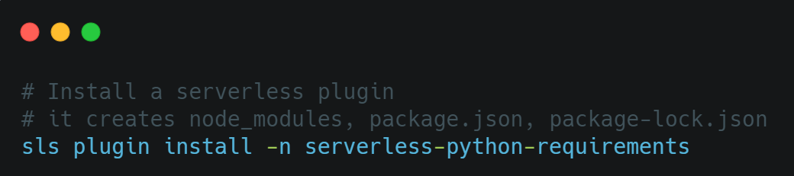

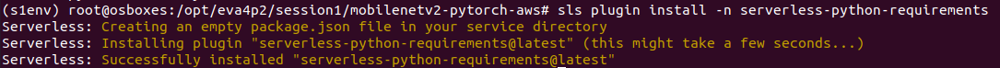

### Deployment script
Deployment Package on AWS Lambda cannot be greater than 250MB (Pytorch itself can be 470MB or more!). so manually create requirements.txt file and add a link to python wheel file (.whl) for Pytorch and Lambda will directly install it for us! 
The requirements.txt should look like this. [(Link)](mobilenetv2-pytorch-aws/requirements.txt)

To enable deploying package through npm command, add a deploy script to package.json file [(Link)](mobilenetv2-pytorch-aws/package.json)

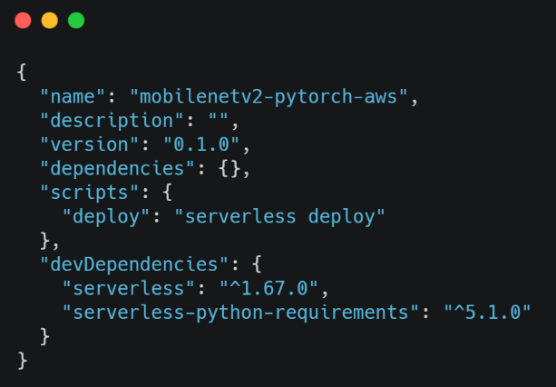

### Update handler function in handler.py [(Link)](mobilenetv2-pytorch-aws/handler.py)
This file shall define the entry handler function for Lambda. It contains application specific code. Following functions are implemented in this file:
1. S3 bucket and path for model file in S3
2. Loading of model from S3 bucket
3. Entry handler functions which will be invoke every time AWS Lanbda function is triggered.
3. Processing of incoming image content and using model for image's classification

### Update configurations in serverless.yml [(Link)](mobilenetv2-pytorch-aws/serverless.yml)
Update this file for configuring AWS as cloud service provider. 

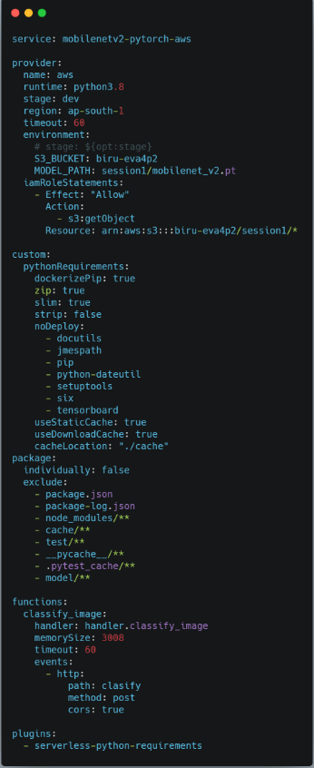

### Creating Model [(Link)](mobilenetv2-pytorch-aws/model/create_mobilenet_v2_model.py)

Create the pretrained mobilenet_v2 model using pytorch. Execute the python file: model/create_mobilenet_v2_model.py

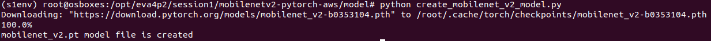

### Uploading model on AWS S3 bucket [(Link)](mobilenetv2-pytorch-aws/model/upload_model_to_s3.py)

Execute the upload_model_to_s3.py python fle to upload the model(mobilenet_v2.pt) onto S3 bucket. Alternatively, model file can be manually uploaded to S3 bucket through AWS console

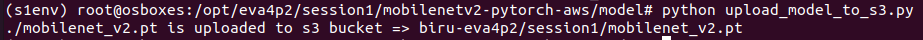

### Finally, Deploy the package

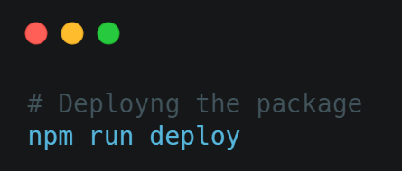

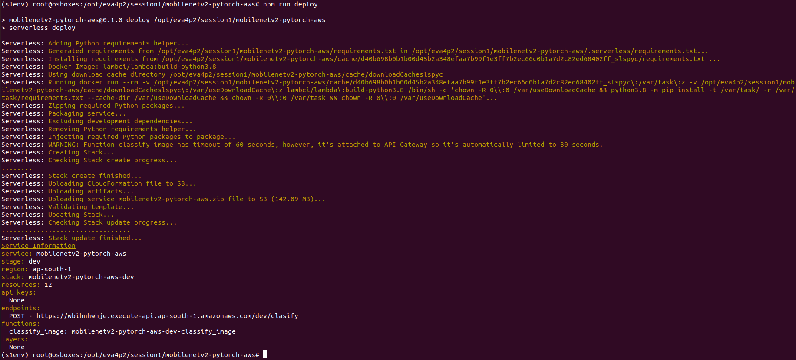

It creates all the necessary AWS resources for running the application. Restful API end point is created on AWS API gateway

**API: https://wbihnhwhje.execute-api.ap-south-1.amazonaws.com/dev/clasify**

> NOTE: We need to allow multipart/form-data content type for the HTTP request and hence visit AWS API gateway console and set "Binary Media Type" as "multipart/form-data"

## Testing Deployment

Insomnia API tool is used to test the deployment. Invoke API with following configurations:

* HTTP Method: POST
* URI: https://wbihnhwhje.execute-api.ap-south-1.amazonaws.com/dev/clasify
* Content-Type: multipart/form-data
* Select image file for claasification: test.jpg

Test image:

Result:

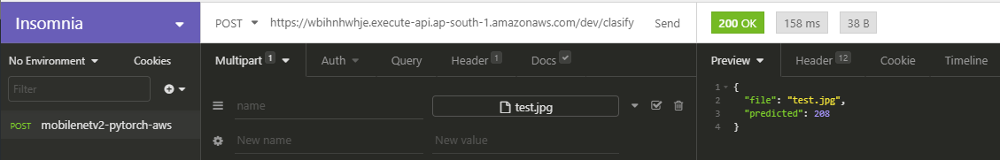

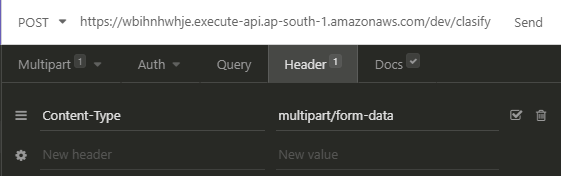

## Demo site [(Visit)](https://s3.ap-south-1.amazonaws.com/www.aijourney.com/eva4p2/s1_demo.html)

Web page is hosted on S3 bucket to test the deployment. user can select image and check the classification result 
> NOTE: first image might take time for processing or might give timeout error, this is due to COLD start setup where Lambda function tries to downloads all the dependencies..

**Web Link:** https://s3.ap-south-1.amazonaws.com/www.aijourney.com/eva4p2/s1_demo.html

