# DRONE IMAGE CLASSIFICATION
 
* **Creating dataset for different type of Drones and flying birds**
* **Build Neural Network for classifying images using Transfer-Learning for Pre-Trained MobileNet_V2 Network**
* **Using Serverless framework, model is deployed onto AWS (Refer folder: s2-mobilenet-drone-aws)** [(Link)](s2-mobilenet-drone-aws)
* **Web page application is hosted on AWS S3 bucket** [(Visit)](https://s3.ap-south-1.amazonaws.com/www.aijourney.com/eva4p2/s2_demo.html)

## Demo site [(Visit)](https://s3.ap-south-1.amazonaws.com/www.aijourney.com/eva4p2/s2_demo.html)

Web page is hosted on S3 bucket to test the deployment. user can select image and check the classification result 
>NOTE
> 1. When application is not used for long time(30 mins and more), then on first time API hit, AWS Lambda try to fetch the application package from S3 bucket and perfom initialization.
> 2. This process is time comsuming and hence API gets timeout during COLD START. 
> 3. Retry mechanism is implemented and app retry the request for max 4 times on timeout. 

**Web Link:** https://s3.ap-south-1.amazonaws.com/www.aijourney.com/eva4p2/s2_demo.html


# Work Summary

## Package Structure

<p align="center">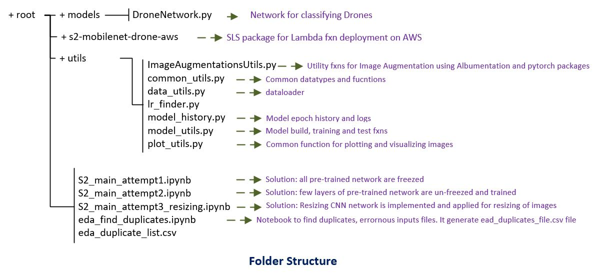</p>


## Dataset Creation
1. Total of 21805 images are collected through various sources (Google images, Bing, Flickr,  yahoo, DuckDuckGo)
2. Images are categorized under four category as:
   1. Large QuadCopters (LQC)
   2. Small QuadCopters (SQC)
   3. Winged Drone      (WD)
   4. Flying Birds      (FB)

**Class distribution**
<p align="center">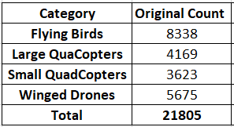</p>

**Sample Dataset**
<p align="center">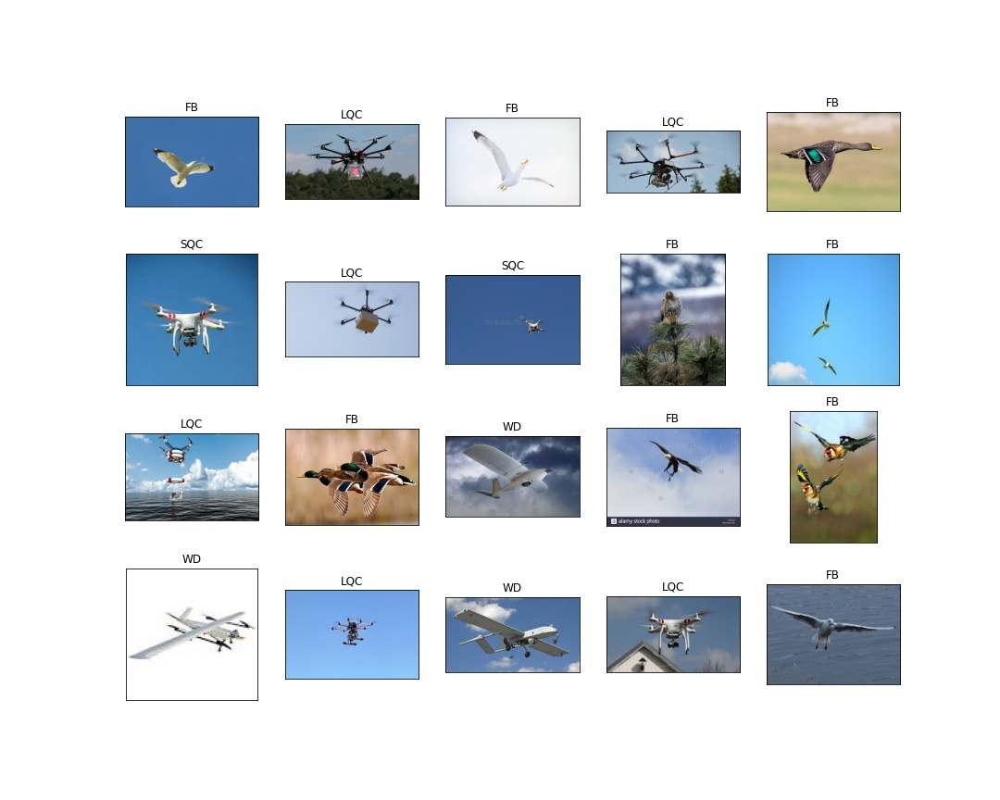</p> 


## Exploratory Data Analysis and Data Handling[(Link)](eda_find_duplicates.ipynb)

For Detailed work on EDA refer notebook eda_find_duplicates.ipynb[(Link)](eda_find_duplicates.ipynb)
This notebook captured duplication and errornous information against each image file and these information is 
finally dumped into **eda_duplicate_list.csv[(Link)](eda_duplicate_list.csv)**

The existing dataset comes with various challenges:
1. Dataset contains few Non-Media files(.txt, .ipynb) and few erronous file of type .GIF, .JFIF and .svg
2. There are many duplicates images within the class
3. There are few duplicate images across the classes
4. There are cases where images are misclassified
5. Dataset are of different resolutions

### Non-Media files and errornour files

Theses images are removed from the dataset
<p align="center">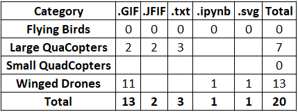</p>

### Handling of Duplicate Images Within Class

To identify the duplicate images, md5 algorithm(using hashlib package) is used to calculate the hash for each file and hash key is compared to identify the duplicate images.
All duplicate images are removed from the dataset.

Total of 2258 duplicate images are found in the dataset.
Distribution of duplicates images are as below:

<p align="center">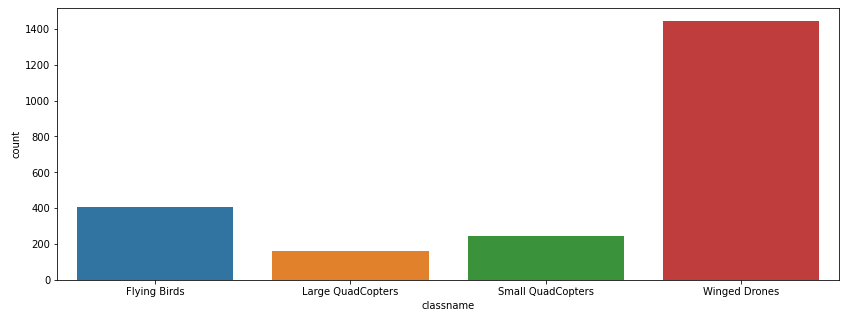</p>

### Handling of Duplicate Images Across Classes
It is also observed that same images are found to be present in multiple classes

Total of 104 duplicate images are found across classes in the dataset. These duplicate images are deleted from the dataset

Here is the summary of duplicate images across classes:
<p align="center">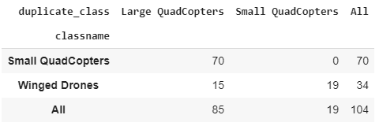</p>

### Misclassified Images

Many images are found to be wrongly labels. Below are the few samples of misclassified images

**Small QuadCopters:** Below images are found in Small QuadCopters but these images are actually belongs to Large QuadCopter class
<p align="center">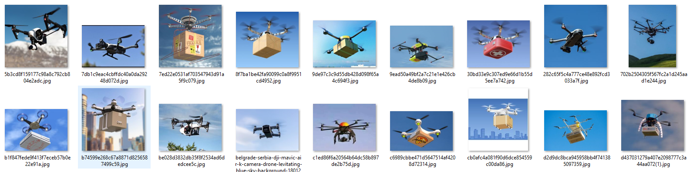</p>

**Winged Drones:** Below images are found in Winged Drone but these images are actually belongs to either Small or Large QuadCopter class
<p align="center">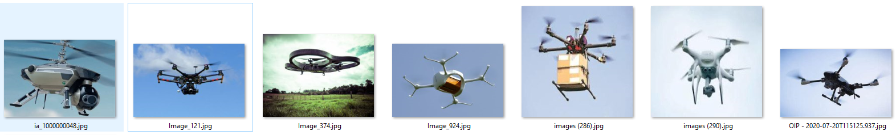</p> 

These misclassified images are retained in the dataset.

### Final Dataset Size

After removing non-media files, errornous images and all duplicate images from the dataset, here is the final dataset size used for building the model.

<p align="center">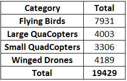</p> 

### Image Augmentation

Following Image augmentaions are applied to generalized the model: Brightness, Contrast, RandomRotation, HorizontalFlip and Cutout

<p align="center">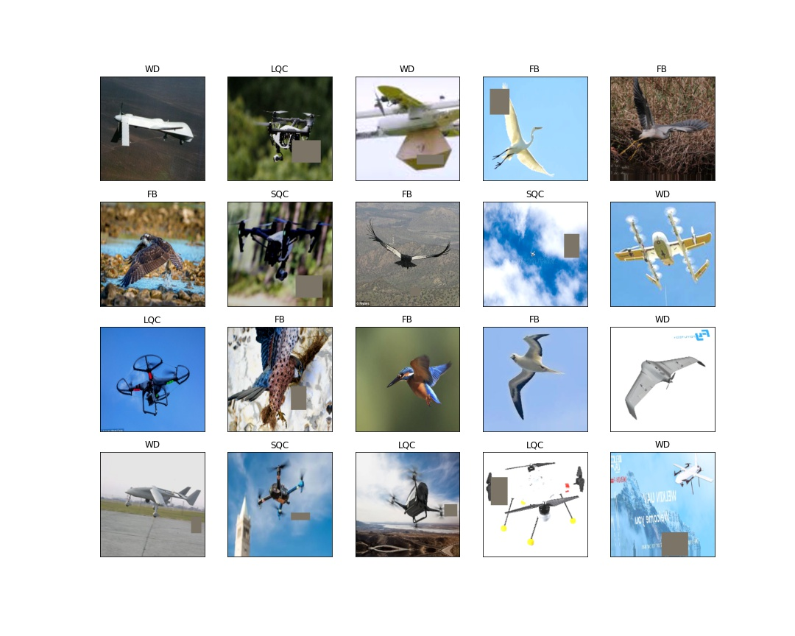</p> 

### Handling of Multi-Resolution Images

Below diagram depicts various image resolutions in dataset. As per distribution majority of image's dimension are above 224 and below 2000..

<p align="center">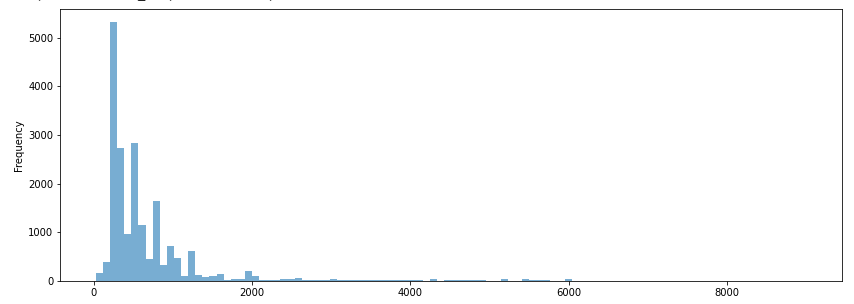</p> 


Very few images fall under 224X224 resolutions. There are around 1051 images under this category.  
<p align="center">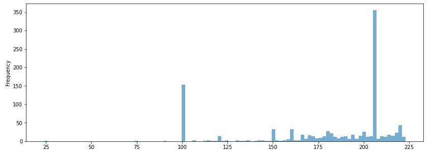</p> 

As per above image size distribution, we need to scale down major chunk of images to 224X224 as this is the standard image size expected by MobiltNet_V2 network.

## Stategy to Handle Multiple Resolution Images

1. The entire dataset is resize into 7 Bins of sizes: 224X224, 448X448, 672X672, 896X896, 1354X1354, 1792X1792, 3584X3584. 
2. Bin category is decided based on closest dimensions the Images belongs to. For Example image size of say 800X800 will fall under 896X896 bin
3. ResizingConvNetwork is designed which define the respective Convolution Network for each Bin. Apprach is to train this convolution network to decide how to scale the images.
4. ResizingConvNetwork get trained, update its weights while training and resize the images of respective bin to 224X224 which is finally fed to the Pre-Trained Mobile_V2 Network

Here is the architechture of entire model including ResizingConvNetwork and Pre-Trained Network. The Model is defined in DroneNetwork.py [(Link)](models/DroneNetwork.py)

<p align="center">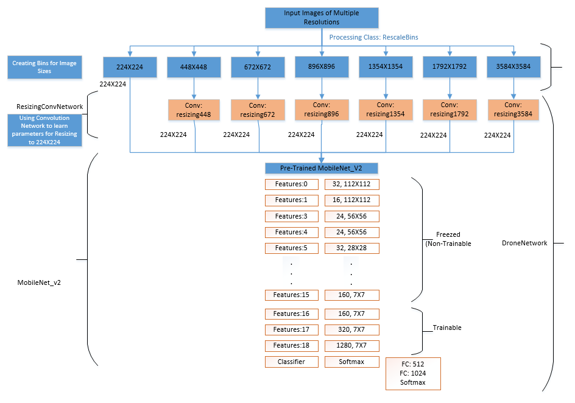</p> 


## Model Building Using Transfer Learning (MobileNet_V2)

### Model Architecture

### Attempt-3: S2_main_attempt3_resizing.ipynb[(Link)](S2_main_attempt3_resizing.ipynb)

1. As explained above, in this experiment ResizingConvNetwork is developed for resizing of images and fed to the Pre-Trained network.
2. MobileNet_V2 network is fine-tuned where the last 3 blocks (features:16, features:17 and features:18) are un-freezed so that their weights 
get learned and updated in each epoch during training. and the last classifier layer is replaced by own fully connected dense layer for classifying four categogy of images.

```
# adding own FC and classification layer.. these layer will be trained 
model.classifier = nn.Sequential(nn.Dropout(0.2),
                                 nn.Linear(1280, 512),
                                 nn.ReLU(),
                                 nn.Dropout(0.2),
                                 nn.Linear(512, 1024),
                                 nn.Linear(1024, 4),
                                 nn.LogSoftmax(dim=1))
```

**NOTE:** 
Model performance is not good here due to batch size. Currently i am facing with an issue that PyTorch Dataloader does not support stacking of images with multiple dimensions and hence i am using batch_size of 1 at this moment.
I would like to invest further effort on investigating this issue and would like to refine this approch with higher batch_size.
Hope i will get a breakthrough to improve the network efficiency on this architecture. 

### Additional Experiments

<p align="center">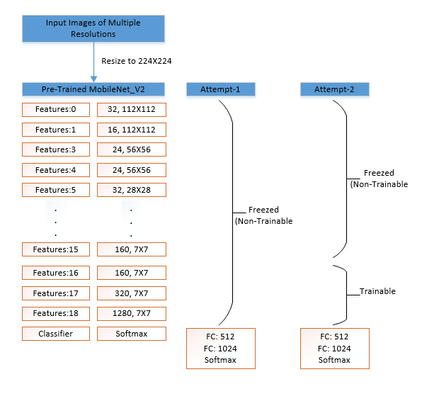</p> 

### Attempt-2: S2_main_attempt2.ipynb[(Link)](S2_main_attempt2.ipynb)

In this experiment, MobileNet_V2 network is fine-tuned where the last 3 blocks (features:16, features:17 and features:18) are un-freezed so that their weights 
get learned and updated in each epoch during training. and the last classifier layer is replaced by own fully connected dense layer for classifying four categogy of images.

### Test Results:

Over all Test Accuracy: 89.82% at Epoch: 18

Class based accuracy:
<p align="center">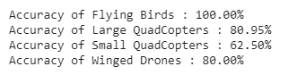</p> 

Accuracy and Loss Graph:
<p align="center">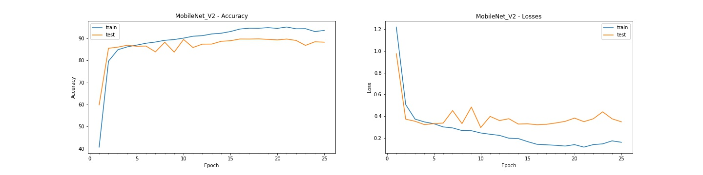</p> 

### Attempt-1: S2_main_attempt1.ipynb[(Link)](S2_main_attempt1.ipynb)

In this experiment MobileNet_V2 network is used as an feature extracter and all the layer are Freezed and made non-trainable.
We don't not need last classifier layer and it is replaced by own fully connected dense layer for classifying four categogy of images.

### Test Results:

Over all Test Accuracy: 87.75% at Epoch: 29

## Sample of Misclassification Results on Test Data (Attempt-2)

**Example of Small QuadCopters which are misclassified by the model:**
<p align="center"></p> 

**Example of Large QuadCopters which are misclassified by the model:**
<p align="center"></p> 

**Example of Winged Drones which are misclassified by the model:**
<p align="center"></p> 

**Example of Flying Birds Drones which are misclassified by the model:**
<p align="center"></p> 


