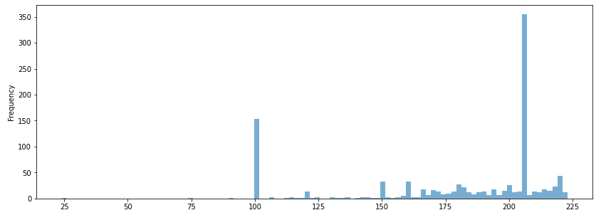

## Explanation for Custom Model Designed to Handle Multiple Resolution Images and Using Pretrained Network

## Handling of Multi-Resolution Images

Below diagram depicts various image resolutions in dataset. As per distribution majority of image's dimension are above 224 and below 2000..

 

Very few images fall under 224X224 resolutions. There are around 1051 images under this category.  

 

As per above image size distribution, we need to scale down major chunk of images to 224X224 as this is the standard image size expected by MobiltNet_V2 network.

## Stategy to Handle Multiple Resolution Images

1. The entire dataset is resize into 7 Bins of sizes: 224X224, 448X448, 672X672, 896X896, 1354X1354, 1792X1792, 3584X3584. 
2. Bin category is decided based on closest dimensions the Images belongs to. For Example image size of say 800X800 will fall under 896X896 bin
3. ResizingConvNetwork is designed which define the respective Convolution Network for each Bin. Apprach is to train this convolution network to decide how to scale the images.
4. ResizingConvNetwork get trained, update its weights while training and resize the images of respective bin to 224X224 which is finally fed to the Pre-Trained Mobile_V2 Network

Here is the architechture of entire model including ResizingConvNetwork and Pre-Trained Network. The Model is defined in DroneNetwork.py [(Link)](../models/DroneNetwork.py)

 

