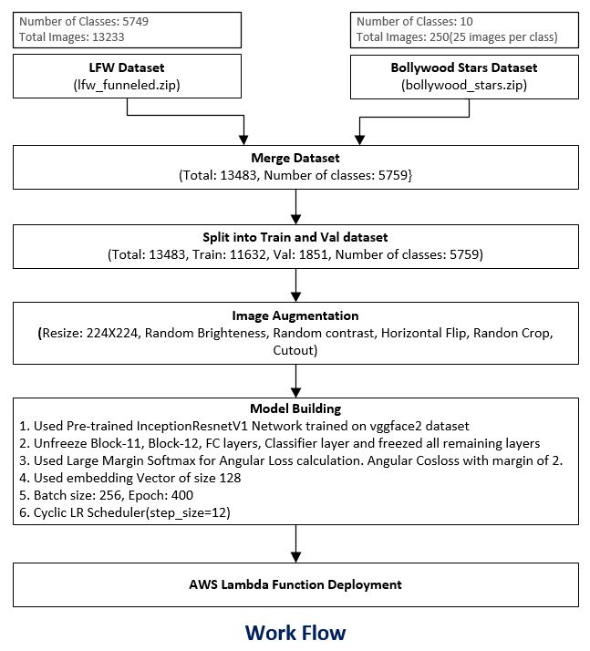
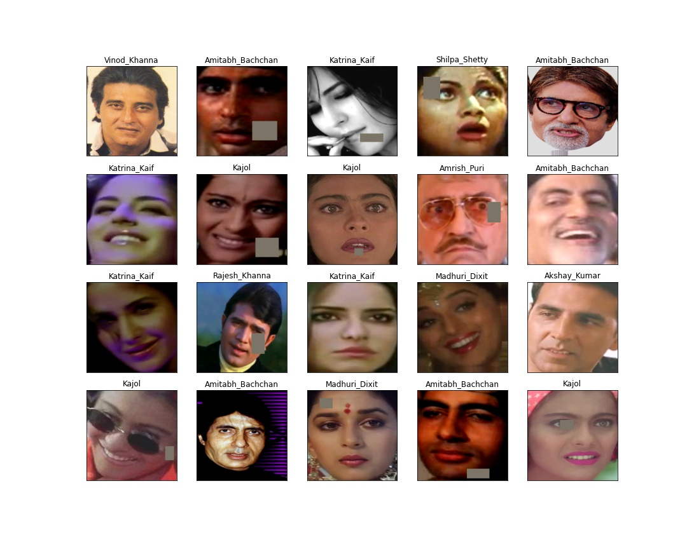
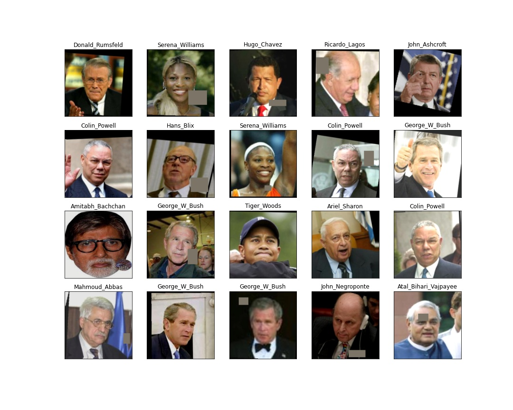
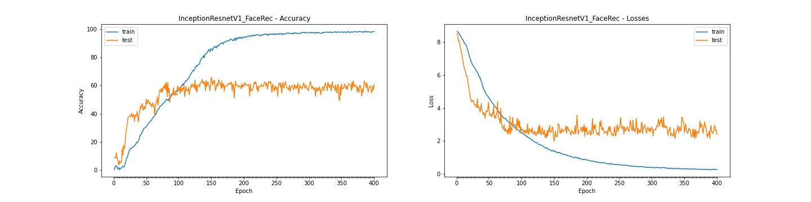
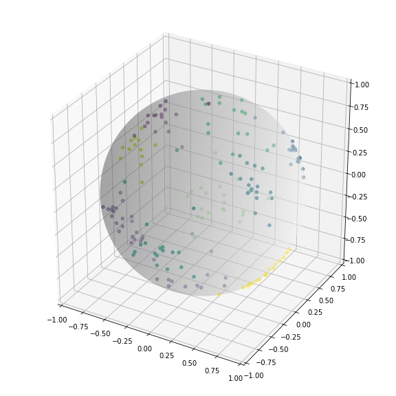

# FACE RECOGNITION

**This is face Recognition solution to recognize 10 Bollywood Stars. Custom dataset is created for Boolywood Stars and are added to LFW-Funneled dataset.
The entire entire dataset is then used to build Face Recognition model.**

# Web Applications

The model is deployed on AWS Lambda using serverless computing framework and the web application is hosted on AWS S3 bucket

**Web Application:** https://s3.ap-south-1.amazonaws.com/www.aijourney.com/eva4p2/s4/s4_fr_lfw.html


# Work Summary

* Dataset Link: [(boolywood_stars dataset)](https://drive.google.com/file/d/1S3C9DjLRLd-ebV6j7PcGYudqJFcpbjrJ/view?usp=sharing)
* AWS Deployment: [(AWS Lambda function and deployment code)](aws_deployment/s4-face-recognize-lfw-aws)

## How is a Model Built?

1. IFW dataset is downloaded from IFW Dataset: http://vis-www.cs.umass.edu/lfw/lfw-funneled.tgz. It has total of 5749 classes.
2. Custom dataset is created for 10 bollywood stars and 25 front face images of each person is collected from google images and IMFDB sources. dataset is maintained in bollywood_stars.zip
3. Custom dataset of 10 bollywood stars are added to the LFW dataset
4. Dataset is splitted into train:test ratio of 70:30 and separate train and val folders are created. Since there are classes having only one or two images so train and val split is done at each classes. 
This is to ensure that for classes having only one or 2 images such samples exists only in train folder as there is no use of having classes in test folder for which there is no corresponding train samples.
because in such case model will have nothing to learn from training samples.
5. Image transformation such as Random Brightness, Random Contrast, Random Crop, Horizontal flip and Cut-out strategies are applied.
6. Pre-trained model **InceptionRestnetV1** which is trained on **vggface2 dataset** is used and their already learned weights from million of faces are used to build the model.
7. Large Margin Softmax is used which calculate Angular **cosloss** by making use of 128 size embedding vector.
8. Model is finally deployed on AWS lambda  



## Sample Dataset

25 Front face images of following 10 bollywood starts are collected:/ 
**Akshay Kumar, Amitabh Bachchan, Amrish Puri, Anil Kapoor, Kajol,**/
**Katrina_Kaif, Madhuri Dixit, Rajesh Khanna, Shilpa Shetty, Vinod Khanna**

**Here is sample of self collected bollywood star images**


Image transformations are applied to the dataset. Dataset is resize to 3X224X224 with following transformation:
```python
means, stds = [0.485, 0.456, 0.406], [0.229, 0.224, 0.225]

train_tf = albumentations.Compose([
                    albumentations.Resize(self.size,self.size),
                    albumentations.RandomBrightness(limit=0.3, p=0.70),
                    albumentations.RandomContrast(limit=0.3, p=0.70),
                    randomCrop[0], randomCrop[1],
                    albumentations.HorizontalFlip(p=0.7),
                    albumentations.CoarseDropout(max_holes=1, max_height=64, max_width=64, min_height=16, min_width=16, fill_value=fill_value, p=0.70),
                    albumentations.Normalize(mean=self.means, std=self.stds),
                    ToTensor()
        ])
```

**Sample of combine dataset(Bollywood stars and LFW) after applying Image Augmentation**


## Attempt-1: Entire dataset(LFW + Custom dataset) is used to build FR model
 
**Notebook:** S4_FaceRecognition_Attempt1_LFW.ipynb [(Link)](notebooks/S4_FaceRecognition_Attempt1_LFW.ipynb)

**AWS Deployment:** AWS Lambda function and deployment code [(aws_deployment/s4-face-recognize-lfw-aws)](aws_deployment/s4-face-recognize-lfw-aws)

**Model Performance**

```Result
Training best result: Accuracy: 98.66 at Epoch 385
Testing  best result: Accuracy: 66.02 at Epoch 150
Accuracy Gap: 32.64
```

```Result
# Class based accuracy for custom people out of 5759 class of people, 
Accuracy of Akshay_Kumar : 87.50%
Accuracy of Amitabh_Bachchan : 12.50%
Accuracy of Amrish_Puri : 62.50%
Accuracy of Anil_Kapoor : 87.50%
Accuracy of Kajol : 50.00%
Accuracy of Katrina_Kaif : 75.00%
Accuracy of Madhuri_Dixit : 62.50%
Accuracy of Rajesh_Khanna : 62.50%
Accuracy of Shilpa_Shetty : 50.00%
Accuracy of Vinod_Khanna : 50.00%
```



## Attempt-2: Only Custom images are used for training (Just for experimenting with short dataset)
 
**Notebook:** S4_FaceRecognition_Attempt2_BW_STARS.ipynb [(Link)](notebooks/S4_FaceRecognition_Attempt2_BW_STARS.ipynb)

**AWS Deployment:** AWS Lambda function and deployment code [(aws_deployment/s4-face-recognize-aws)](aws_deployment/s4-face-recognize-aws)

**Model Performance**

```Result
Training best result: Accuracy: 100.00 at Epoch 407
Testing  best result: Accuracy: 92.00 at Epoch 479
Accuracy Gap: 8.00
```


**Plotting Embedding Vector**\
Embedding vector of size 3 is used and below shows how each images are positions




