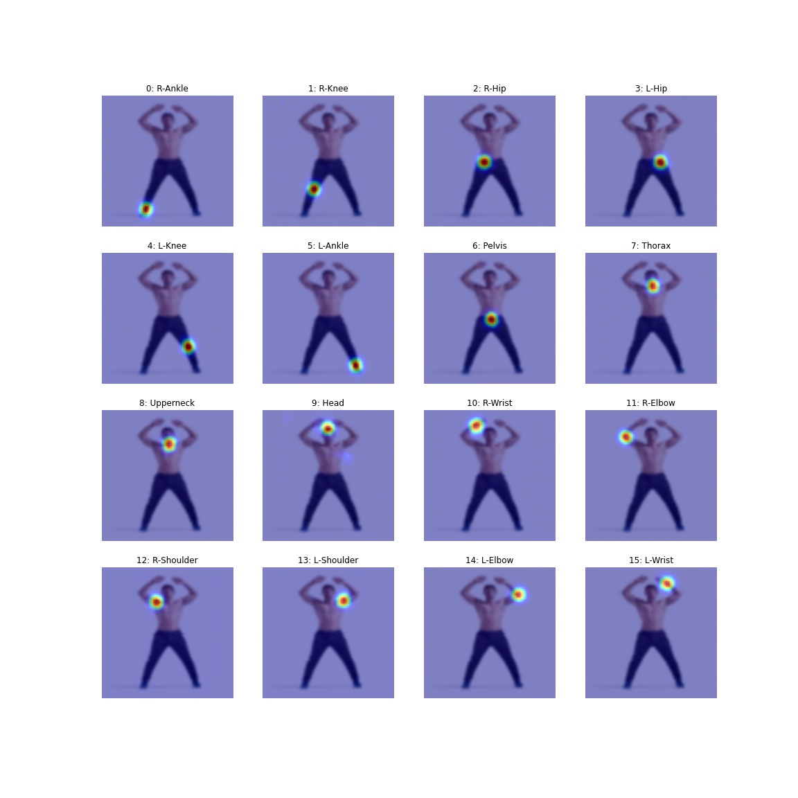

# HUMAN POSE ESTIMATION

**This is HPE solution to predicts 16 joints of the human body. Pre-Trained Resnet50 model on MPII dataset is used and converted into QNNX format and Quantized and finally deployed on AWs Lambda**

## Paper Description [(Link)](paper_description): 
In above link attempt is made to understand and description the important points of Model Architecture and simple baseline method as used in paper https://arxiv.org/pdf/1804.06208.pdf.

# Web Applications

The model is deployed on AWS Lambda using serverless computing framework and the web application is hosted on AWS S3 bucket

**Web Application:** https://s3.ap-south-1.amazonaws.com/www.aijourney.com/eva4p2/s5_hpe.html

##


##

## Work Summary

1. Pytorch Resnet50 model trained in MPII dataset is used.
2. Model is converted into ONNX format
3. ONNX model is quantized to reduce the model file size from 130MB to around 65MB
4. ONNX Runtine is used for inferencing the model
5. As target is to deploy the model into AWS Lambda, so no pytorch packages is used here. PIL and Numpy function is used to resizing the image and normalization.
6. Package dependency: numpy, PIL, OpenCV, onnxruntine
7. With above apporach, package size for AWS lambda is around 110MB and its well within the limit required for deployment.
9. Model is finally deployed on AWS lambda  
   **AWS Deployment:** AWS Lambda function and deployment code [(aws_deployment/s5-hpe-onnx-aws)](aws_deployment/s5-hpe-onnx-aws)


## Reference Materials
1. https://github.com/Microsoft/human-pose-estimation.pytorch
2. Paper: https://arxiv.org/pdf/1804.06208.pdf
3. Model is downloaded from: https://onedrive.live.com/?authkey=%21AFkTgCsr3CT9%2D%5FA&id=56B9F9C97F261712%2110709&cid=56B9F9C97F261712

## Pytorch to ONNX format and Quantization
 
**Notebook:** S5_HPE_Pytorch_To_Onnx.ipynb [(Link)](notebooks/S5_HPE_Pytorch_To_Onnx.ipynb)

- Pytorch model size (MB): 136.34
- ONXX model size (MB): 136.25
- ONXX Quantized model size (MB): 65.93

## Model Inferencing using OnnxRuntime
 
**Notebook:** S5_HPE_OnnxRuntime_Inferencing.ipynb [(Link)](notebooks/S5_HPE_OnnxRuntime_Inferencing.ipynb)

**Image transformation**
As target is to deploy the model without using any pytorch packages or functions hence image transformation, resizing and channel format are doen using PIL and Numpy fucntions

**Input Image Transformation:** hpe_transform_utils.py [(Link)](notebooks/utils/hpe_transform_utils.py)

**Test Image**


**Joint Position Display on Input Image** hpe_vis_utils.py [(Link)](notebooks/utils/hpe_vis_utils.py)

Model return 16 Joints position in 64X64 data format. Visualization of all the joints are as below

```
# 16 64X64 images output for joints are in these order for Resnet50 model
JOINT_NAMES = ['R-Ankle', 'R-Knee', 'R-Hip', 'L-Hip', 'L-Knee', 'L-Ankle', 'Pelvis', 'Thorax', 'Upperneck', 'Head', 'R-Wrist', 'R-Elbow', 'R-Shoulder', 'L-Shoulder', 'L-Elbow', 'L-Wrist']

def vis_joints(img:PIL, output, save_filename=None):
    fig = plt.figure(figsize=(16, 16))
    for idx, joint_data in enumerate(output):
        ax = fig.add_subplot(4, 4, idx+1, xticks=[], yticks=[])
        plt.title(f'{idx}: {JOINT_NAMES[idx]}')
        H, W = joint_data.shape
        plt.imshow(img.resize((W, H)), cmap='gray', interpolation='bicubic')
        plt.imshow(joint_data, alpha=0.5, cmap='jet', )
        plt.axis('off')
    
    if save_filename:
      fig.savefig(save_filename)
    return
```



**Skeleton view on input image** hpe_skeleton_utils.py [(Link)](notebooks/utils/hpe_skeleton_utils.py)

Displaying all Joints position together and connecting the relevant Joint to show skeleton on Input Image

```
# Based on Joint position as in JOINT_NAMES, these are the pair we need to join
JOINT_IDX_PAIRS = [[0,1], [1,2], [2,6],      # R-ankel -> R-Knee, R-Knee -> R-Hip, R-Hip -> Pelvis
                   [5,4], [4,3], [3,6],      # L-ankel -> L-Knee, L-Knee -> L-Hip, L-Hip -> Pelvis
                   [6,7], [7,8], [8,9],      # Pelvis -> Thorax, Thorax -> Upperneck, Upperneck -> Head
                   [7,12], [12,11], [11,10], # Thorax -> R-Shoulder, R-Shoulder -> R-Elbow, R-elbow -> R-Wrist
                   [7,13], [13,14], [14,15]] # Thorax -> L-Shoulder, L-Shoulder -> L-Elbow, L-elbow -> L-Wrist
				   
def get_skeleton(img:PIL, output):
    img = np.array(img)

    '''
    Get the x,y coordinate from joint image of size 64X64. Pick the position of max value
    Get pixel value and x,y corordinates: (val, (x,y))
    '''
    get_joint_location = lambda joints: map(itemgetter(1, 3), [cv2.minMaxLoc(joint) for joint in joints])
    joint_locations = list(get_joint_location(output))
        
    IMG_H, IMG_W, _ = img.shape         # Input Image Dimension
    OUT_W, OUT_H = output[0].shape      # Joints Image Dimension

    # Lambda fxn to get relative x,y, position based on image size
    get_X = lambda x: int(x * IMG_W / OUT_W)
    get_Y = lambda y: int(y * IMG_H / OUT_H)

    # Mark all joint positions on the original image
    color = (0, 0, 255)
    thickness = 2
    for _ , (x,y) in joint_locations:
        # Get relative x,y, position based on image size
        x, y = get_X(x), get_Y(y)
        cv2.ellipse(img, (x, y), (4, 4), 0, 0, 360, color, thickness) #cv2.FILLED)

    # iterate through Joint pair and draw line between two joint positions
    for start, end in JOINT_IDX_PAIRS:
        _ , (x1,y1) = joint_locations[start]
        _ , (x2,y2) = joint_locations[end]

        # Get relative x,y, position based on image size
        x1, y1 = get_X(x1), get_Y(y1)
        x2, y2 = get_X(x2), get_Y(y2)

        # Join the two points by drawing line
        color = (0, 255, 0)        
        cv2.line(img, (x1, y1), (x2, y2), color, 2)
            
    return img
```


