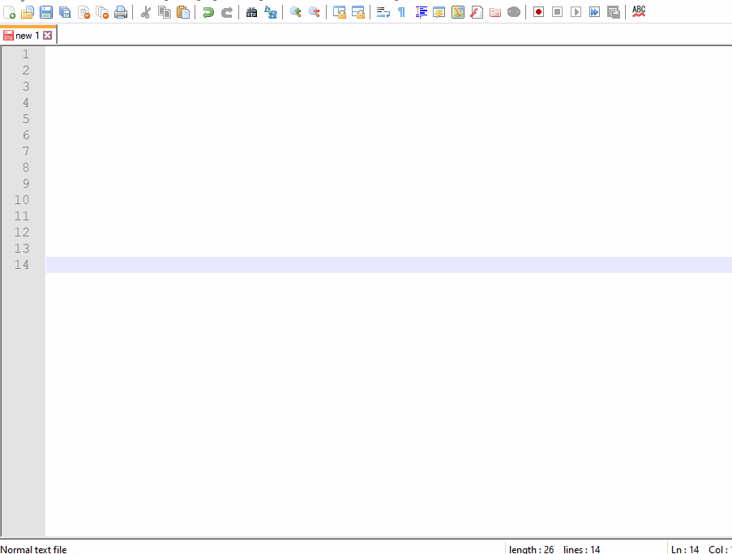
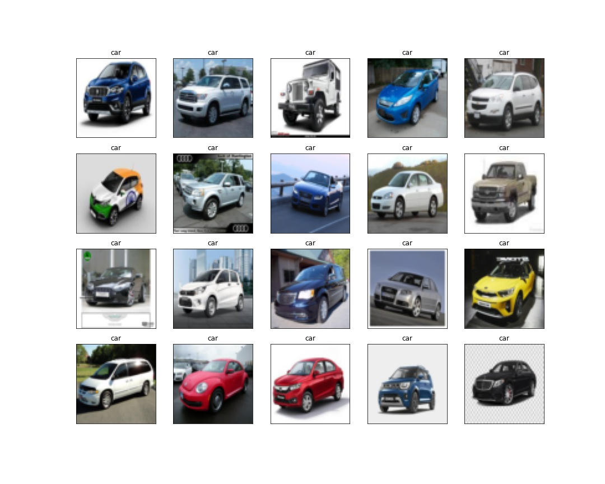
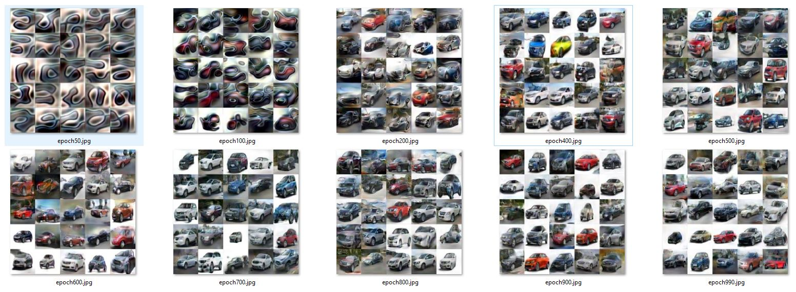
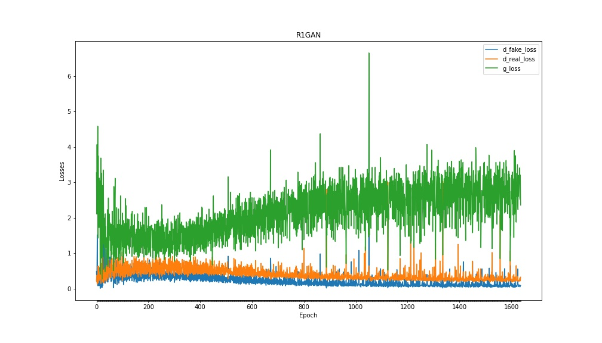
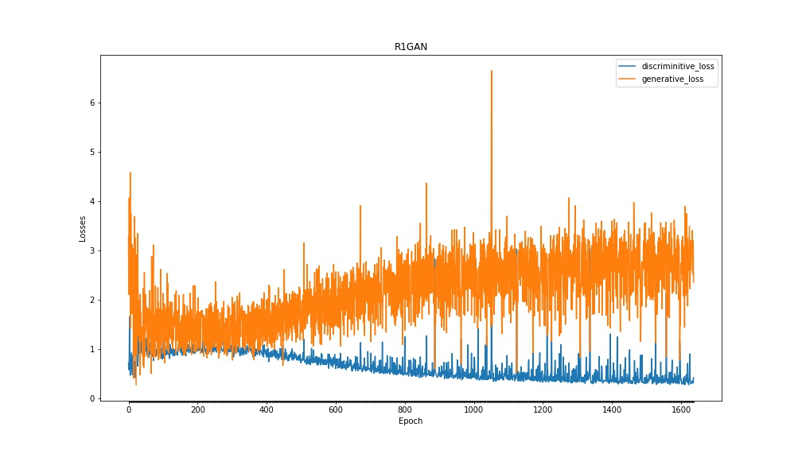
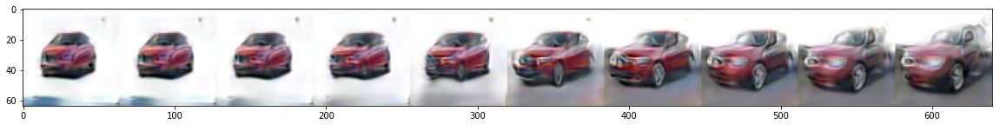

# GENERATIVE ADVERSARIAL NETWORK

**This is implementation of GAN with R1 Regularizer to generate India Car images. GAN network is build on 700+ Indian car dataset collected through google images.**

## Web Application and AWS Lambda Deployment

The model is deployed on AWS Lambda using serverless computing framework and the web application is hosted on AWS S3 bucket

**AWS Deployment Code:** AWS Lambda function and deployment code [(aws_deployment/s6-gan-aws)](aws_deployment/s6-gan-aws)
 
**Web Application:** https://s3.ap-south-1.amazonaws.com/www.aijourney.com/eva4p2/s6/s6_gan.html


## Web App Demonstration




## Dataset [(link)](https://drive.google.com/file/d/1RT85hbmnCWRHu4Dl9EsJ38urlD1O0KkZ/view?usp=sharing)

700+ Indian car images are collected from google images. For simplicity, car with front facing and specific angle position are collected.

Dataset Size: 704



## GAN Model Creation
 
**Notebook:** /notebooks/S6_R1GAN_Car.ipynb [(Link)](notebooks/S6_R1GAN_Car.ipynb)

**GAN Network:** /notebooks/models/gan_net.py [(Link)](notebooks/models/gan_net.py)

```python
batch_size=64
epochs=1600
n_noise = 256 # noise vector size for Generator
```

**Epoch Results**



**Real and Fake Discriminitive losses**


**Generative and Discriminitive Losses**


**Interpolation**
Single image is generated and inperpolated for 10 diferent variants



