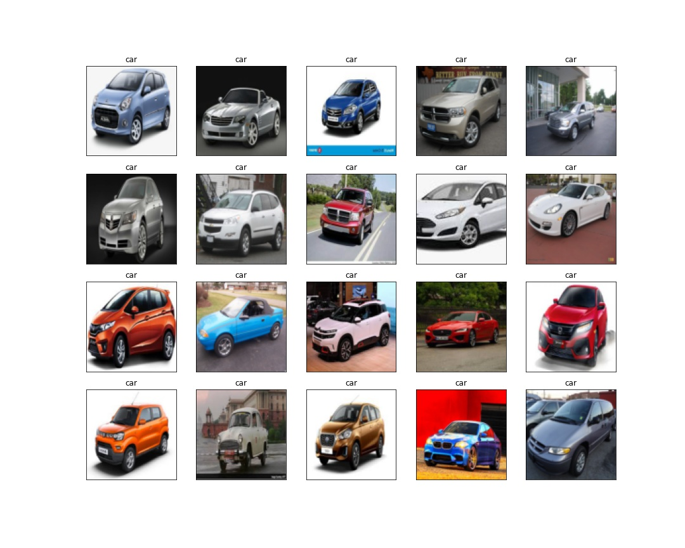
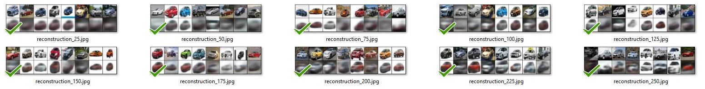
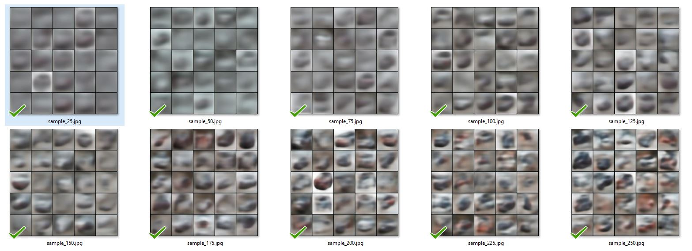
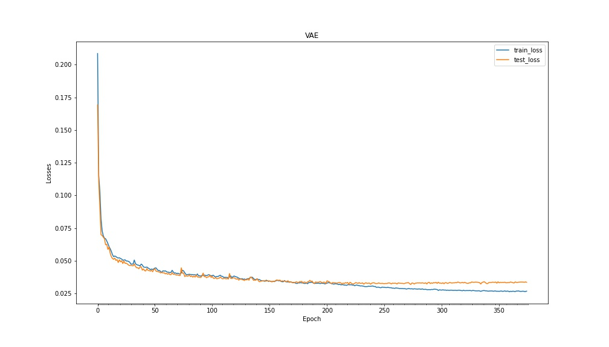
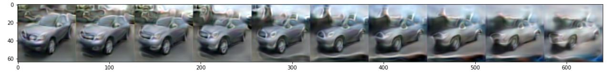

# VARIATIONAL AUTO ENCODERS

**This is implementation of VAE using KLD loss function to generate India Car images. VAE network is build on 700+ Indian car dataset collected through google images.**

## Web Application and AWS Lambda Deployment

The model is deployed on AWS Lambda using serverless computing framework and the web application is hosted on AWS S3 bucket

**AWS Deployment Code:** AWS Lambda function and deployment code [(aws-deployment/s7-vae-aws)](aws-deployment/s7-vae-aws)
 
**Web Application:** https://s3.ap-south-1.amazonaws.com/www.aijourney.com/eva4p2/s7/s7_vae.html


## Web App Demonstration


## Dataset [(link)](https://drive.google.com/file/d/1RT85hbmnCWRHu4Dl9EsJ38urlD1O0KkZ/view?usp=sharing)

700+ Indian car images are collected from google images. For simplicity, car with front facing and specific angle position are collected.

Dataset Size: 704



## VAE Model Creation
 
**Notebook:** /notebooks/S7_VAE_Car.ipynb [(Link)](notebooks/S7_VAE_Car.ipynb)

**VAE Network:** /notebooks/models/vae_net.py [(Link)](notebooks/models/vae_net.py)

```python
batch_size=64
latent dimention = 256 # mean and standard deviation vector size for samples nornal distribution for Decoder
```

## Epoch Results

**Actual vs Reconstructed Images**



**Decoder Results**



**Loss plot**


**Interpolation**
Single image is generated and inperpolated for 10 diferent variants



