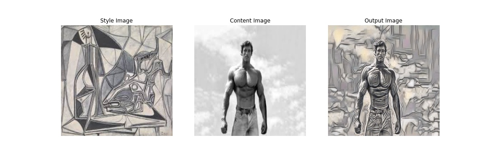

# NEURAL STYLE TRANSFER

**This is implementation of Neural Style Transfer Model that take an image and reproduce it with a new artistic style. The algorithm takes three images, an input image, a content-image, and a style-image, and changes the input to resemble the content of the content-image and the artistic style of the style-image**

**Web Page:** https://s3.ap-south-1.amazonaws.com/www.aijourney.com/eva4p2/s8/nst/s8_nst.html

## Description

**Notebook:** /notebooks/S8_NST_Main.ipynb [(Link)](notebooks/S8_NST_Main.ipynb)

1. VGG19 pre-trained model is used
2. Content Loss and Style Loss function is used. Style Loss function make use of GRAM Matrix.
3. For Content Loss: 'conv_4' layer is used to compute the content loss
4. For Style Loss:  ['conv_1', 'conv_2', 'conv_3', 'conv_4', 'conv_5'] layers are used to compute the Style Loss


```python
img_size=512
num_steps=1000
```

## Results




