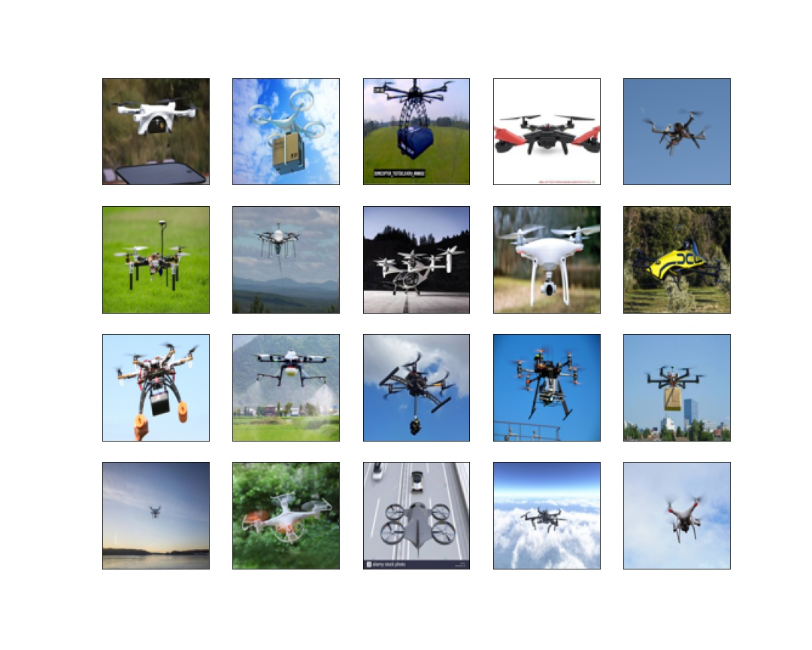
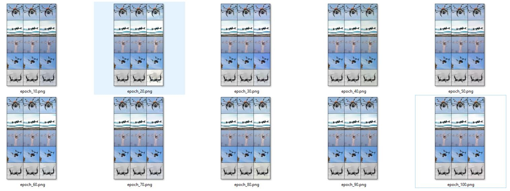
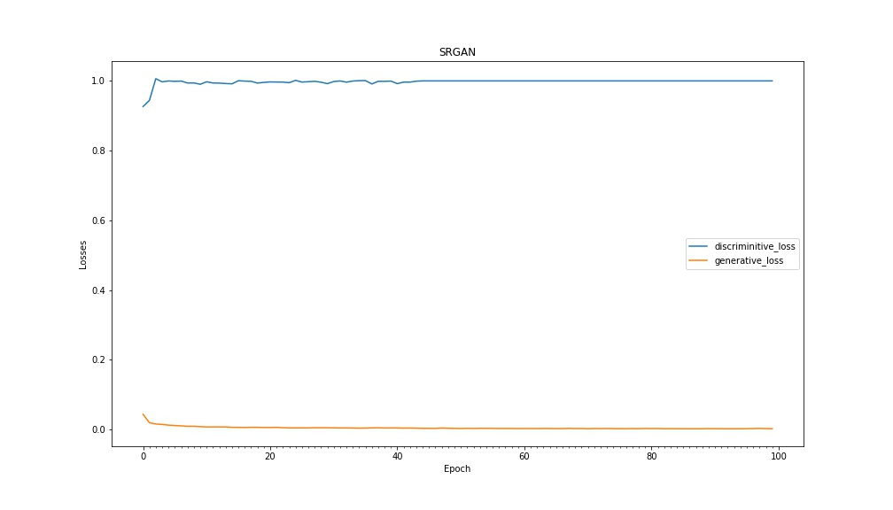
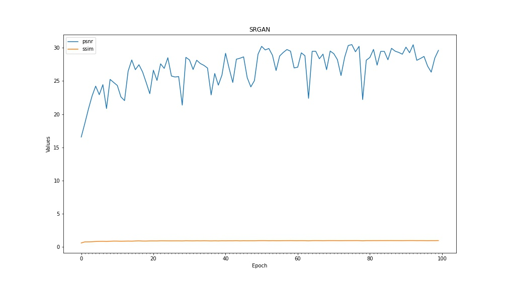
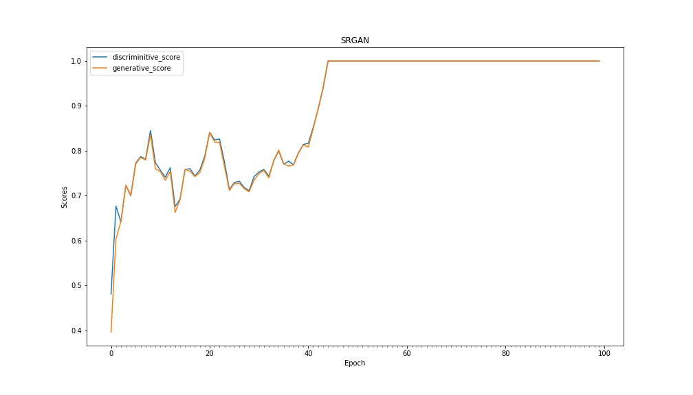
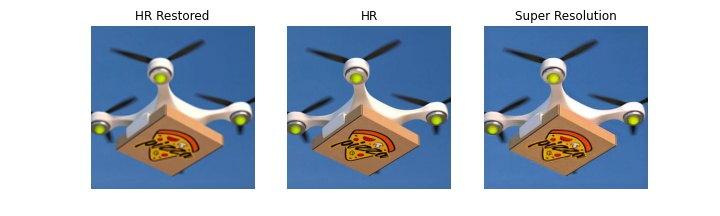
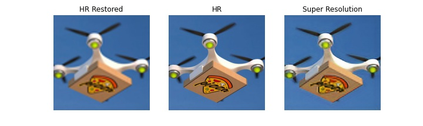
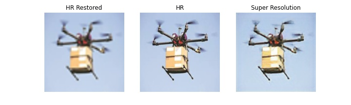

# IMAGE SUPER RESOLUTION MODEL (SRGAN)

**This is implementation of Image Super Resolution using SRGAN network for self created Drone images dataset**

## Web Application and AWS Lambda Deployment

The model is deployed on AWS Lambda using serverless computing framework and the web application is hosted on AWS S3 bucket

**AWS Deployment Code:** AWS Lambda function and deployment code [(aws-deployment/s8-sr-aws)](aws-deployment/s8-sr-aws)
 
**Web Application:** https://s3.ap-south-1.amazonaws.com/www.aijourney.com/eva4p2/s8/sr/s8_sr.html

## Web App Demonstration


## Dataset [(link)](https://drive.google.com/drive/folders/1nsJIyTlz4APUZKjNCSnh7QiJt4vdK53k?usp=sharing)

The entire dataset is having 4 classes but Model is trained on  for Large QuadCopters images and around 1000 images are used.

Dataset Size: 1000



# Image Super Resolution Model Creation

## SRGAN with upscale_factor=2
 
**Notebook:** /notebooks/S8_SRGAN_SF2_Drone.ipynb [(Link)](notebooks/S8_SRGAN_SF2_Drone.ipynb)

**SRGAN Network:** /notebooks/models/srgan_net.py [(Link)](notebooks/models/srgan_net.py)

```python
batch_size=64
upscale_facor=2
epochs=100
```

## Epoch Results

**Epoch wise Real vs Super Resoltuion Images**

> Note: Image sequence shall be read as:  HR Restore Image - HR Image - Super Resolution Image



**Losses plot**


**PSNR vs SSIM Results**



**Score Results**



## Test Sample



## SRGAN with upscale_factor=4
 
**Notebook:** /notebooks/S8_SRGAN_SF4_Drone.ipynb [(Link)](notebooks/S8_SRGAN_SF4_Drone.ipynb)

## Test Sample






